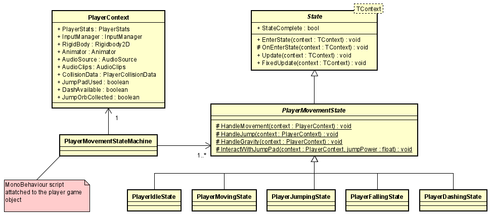
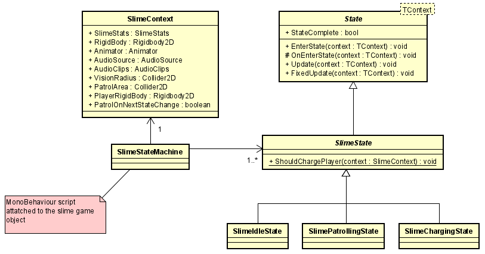

# Contribution Reflections
Since this game has been a solo project, it's hard to write about all my contributions, as that would take up like 10 pages. I'll therefore talk about the thing I found the most interesting, which is my state machine system.

## Repository
Here is a link to my repository, which contains the source code and my blog posts:
[https://github.com/ForgottenIce/GMD](https://github.com/ForgottenIce/GMD)

## State Machine
To get a better overview of my state machine system, here is a class diagram:



**State and PlayerMovementState**
I have defined an abstract class `State`, which takes a generic type parameter `TContext`. `TContext` is used as parameter to all the methods inside the `State` class. Then I have the class `PlayerMovementState`, which inherits from the `State` class with `PlayerContext` as the generic type parameter. It's defined like so:

```c#
public abstract class PlayerMovementState : State<PlayerContext>
```

**Concrete States**
The `PlayerMovementState` is an abstract base class that all the concrete states related to player movement will inherit from. Now a concrete context is passed to all the methods from the `State` class, which in this case is `PlayerContext`.

Each concrete state can now implement what should happen in `Update` and `FixedUpdate`. An example of a concrete movement state can be found here:

```c#
public class PlayerJumpingState : PlayerMovementState
{
    protected override void OnEnterState(PlayerContext context)
    {
        context.Animator.Play("player_jump");
        var jumpAudioClip = context.AudioClips.GetClip("player_jump");
        context.AudioSource.PlayOneShot(jumpAudioClip);
    }

    public override void FixedUpdate(PlayerContext context)
    {
        if (context.CollisionData.TouchingGround
          || context.RigidBody.velocity.y <= 0
          || context.InputManager.DashHeld
          || (!context.InputManager.JumpHeld && !context.JumpPadUsed))
        {
            StateComplete = true;
            return;
        }
        
        HandleMovement(context);
        HandleGravity(context);
        
        var currentVelocity = context.RigidBody.velocity;
        if (context.CollisionData.TouchingCeiling)
        {
            currentVelocity.y = 0;
        }
        
        context.RigidBody.velocity = currentVelocity;
    }
}
```

`PlayerJumpingState` implements the `OnEnterState` method and the `FixedUpdate` method. To actually modify any state related to the player, it gets a reference to the various components that's attached to the player game object through the `PlayerContext` parameter. Properties of these components can then be modified within the `OnEnterState` method and the `FixedUpdate` method to adjust what should happen to the player in this state.

At the top of the `FixedUpdate` method, there is an if-statement. A similar if-statement can be found in all concrete states. This if-statement determines the conditions for when the concrete state should complete. In the context of jumping, that would for example be when the player touches the ground or if the player is falling. If this if-statement returns true, the `StateComplete` boolean is set to true and the state will no longer be active.

**PlayerMovementStateMachine**
The `PlayerMovementStateMachine` is the script that is attached to the player game object in Unity. It inherits from `MonoBehaviour`. This script has all the references to the components of the player game object. It also holds instances of each concrete `PlayerMovementState`. Lastly, it also instantiates an instance of the `PlayerContext` class, with references to all the player's components.

 `PlayerMovementStateMachine` is the "brain" of the state machine. It's responsible for calling the `Update` method for the currently active state, as well as determining what the next state should be when a state has finished. Here is the `Update` method of `PlayerMovementStateMachine`:

```c#
private void Update()
{
    if (_currentState.StateComplete)
    {
        SelectState();
    }
    _currentState.Update(_playerContext);
}
```

The `Update` method calls `_currentState.Update(_playerContext)` each frame. If `_currentState.StateComplete` is true, it will call the `SelectState` method

The `SelectState` method determines what the next state of the player should be, and sets the `_currentState` to the correct state. It then calls `_currentState.EnterState(_playerContext)`, which allows the concrete state to handle what should happen when the state is entered.

**Shared Logic Between States**
There are cases where multiple states need to implement the same logic. An example of this could be left/right movement. The player should be able to move left/right regardless of if they are in the `PlayerMovingState`, `PlayerJumpingState`,  or `PlayerFallingState`. Instead of implementing this logic 3 times in each concrete state, it can be implemented directly on the `PlayerMovementState` base class that the concrete states inherit from. Then each concrete state can simply call the `HandleMovement` method, where the behavior is defined only once.

## Enemy State Machine
The neat thing about this state machine implementation is that it can be used for different use cases. In my project, I also used this state machine for my slime enemy.



It's the exact same formula, but instead of using `PlayerContext`, the slime state machine uses `SlimeContext`. Each concrete state then inherits from the `SlimeState` base state.

## Closing thoughts
I hope my explanation of my state machine implementation made sense. There are a lot of other topics I would have liked to cover in this reflection, but I think we're reaching the character limit! This project has been quite the learning experience, and also very fun to work on. Anyways, that's it for me.