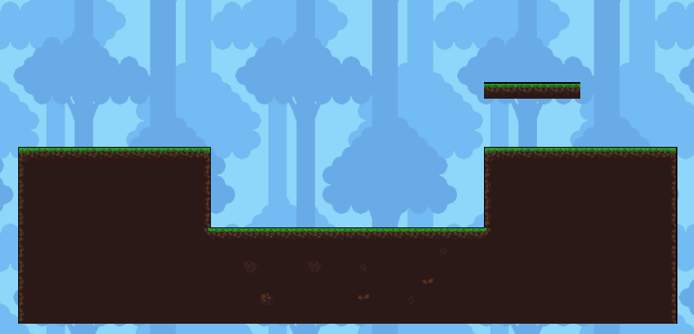
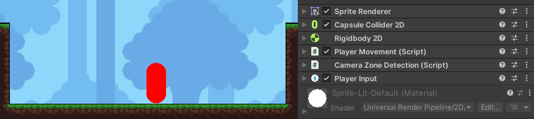
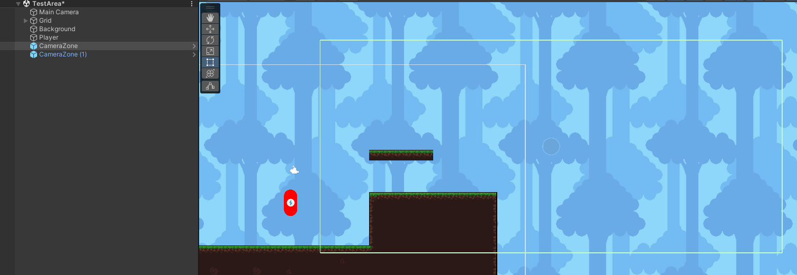

# Development Update #1
So my first development update is here at last. My first milestone for the project was about creating `A Test Level With a Playable Character`. Let's dig into it!

## Test Level
So the first thing I did was creating the test level. I quickly realized that for my type of game, a tilemap would be the perfect fit. It will make creating levels a lot easier in the long run. So I found some assets online and created my first test area.

Not the prettiest thing, but I figured it would work perfectly for testing the various types of collision that my future character should account for, such as floors, walls and ceilings.

## The Player
Next up was the playable character. I started off creating a game object with a Rigidbody2D for physics and a CapsuleCollider2D for collision. To control the character, I am using Unity's "new" input system. At last, I have a PlayerMovement script that is responsible for handling the inputs and moving the player around.

So far, I have implemented left/right movement, a jump mechanic and gravity. In the milestone, I had a lot of emphasis on the fact that the moveset should feel satistfying. I ended up spending a lot more time on fine tuning this than I would admit, and I never reached a result I was satistfied with. Turns out this task was a lot more tedious than I could have imagined, and it ended up demotivating me from working on the project for a bit. So I decided to deviate from that task and work on something else.

## Camera & Camera Zones
To get a break from working on the playable character, I started working on camera movement. For the most part, all the camera should really do is to follow the player. This was done with a simple CameraController script that has a reference to the Player's Transform. So that was it... but then I had an idea! I wanted to implement a system where certain zones in the level would move the camera to a fixed position. Introducing camera zones:

The camera zone is simply an empty game object with a BoxCollider2D on it. IsTrigger is enabled. The collider has been resized to match the size of the camera, making it easy to see what will be visible when the camera zone is activated. The green outline on the image above shows what this looks like in the editor.

The Player object has a CameraZoneDetection script, that detects whenever the player is inside a camera zone. When that happens, the script tells the CameraController to target the camera zone instead of the player. Here's a demonstration:

To top it off, I have implemented a transition timer that uses the Vector2D.Lerp function to smoothly transition between the camera zones and the player. I think this turned out great!

## Closing Thoughts
So that was my first development update. I accomplished most of what I had set out to do in my first milestone, although I didn't really work that much on movement abilities and objects that the player can interact with. I also learned that it is not that productive to try and perfect one feature of the game (the player movement in this case). I should instead focus my energy on creating something that works, and then move on to something else so that I will actually have a finished product in the end.

My next milestone is a bit vague at the moment, so I'm not entirely sure what is next, but I have a lot of ideas.