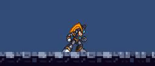
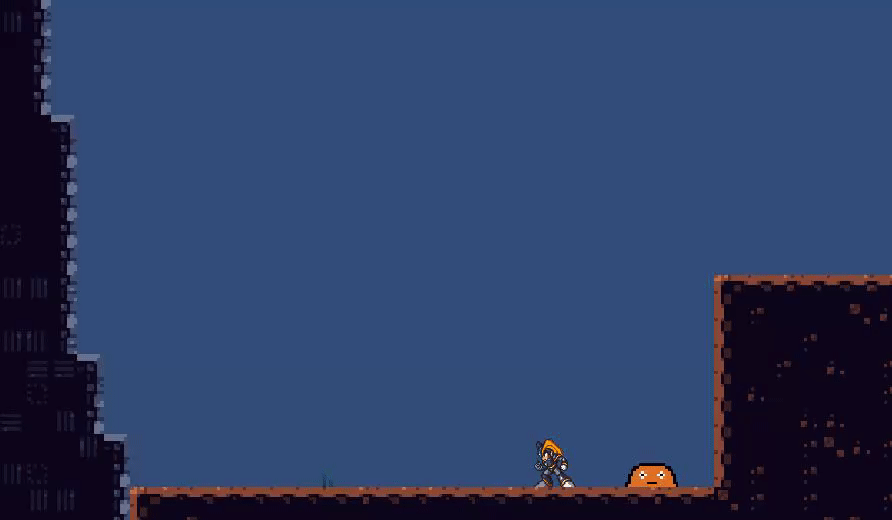
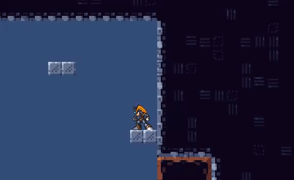
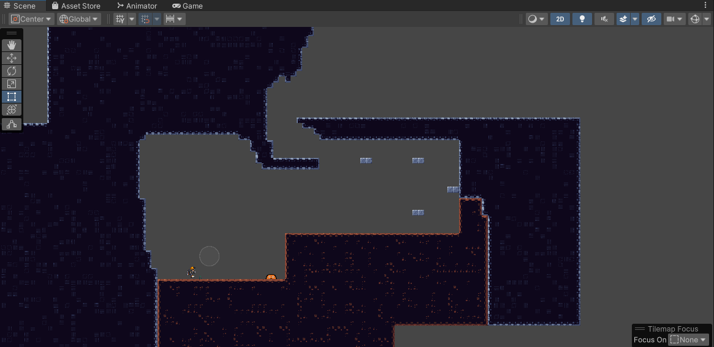
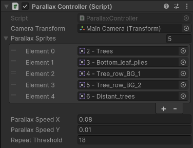

# Development Update #2
My second milestone for the project was about creating `Player Sprites, Gameplay Elements & Level Building`. Here is how it went!

## Player Sprites
So in the first dev-update, it was seen that the player was just a red cylinder. The first thing I did for this milestone was changing that. Since I'm not an artist, I found a spritesheet online that had pretty much all the movement states that I need: idle, walk, jump, fall, land and dashing.



A lot of configuring was done in Unity itself to load the spritesheet, get each frame, resize it etc. With that done, a `Player` Animation Controller was configured with an Animation Clip for each of the states. Now, to actually switch between the states, some scripting had to be done. I updated my PlayerMovement script and added C# events for the different states:

```c#
public event Action<float /* moveSpeed */, float /* maxSpeed */> Moving;
public event Action<float /* moveDirection */> DirectionChanged;
public event Action Stopped;
public event Action Jumped;
public event Action Falling;
```

The idea is that other parts of the code can subscribe to these events and define what should happen when the event is raised. I updated the respective parts of the PlayerMovement script to raise the different events when appropriate. Here is my HandleGravity method for example:

```c#
private void HandleGravity()
{
    if (!_touchingGround)
    {
        float newFallSpeed = _frameVelocity.y + gravity;
        if (newFallSpeed < -maxFallSpeed) newFallSpeed = -maxFallSpeed;
        _frameVelocity = new Vector2(_frameVelocity.x, newFallSpeed);
        _canJump = false;
        if (_frameVelocity.y < 0)
        {
            Falling?.Invoke(); // <-- event is invoked
            _pendingJumpPower = 0;
        }
        else Jumped?.Invoke(); // <-- event is invoked
    }
    ...
}
```

Now that the events can be raised, someone needs to respond to the events. I created a PlayerAnimation script for this purpose. This script has access to the Unity Animator component, and is responsible for updating the animations. The script subscribes to all the events in PlayerMovement and define what should happen when the events are invoked. Here is an example:

```c#
_playerMovement.Moving += (moveSpeed, maxSpeed) =>
{
    _animator.speed = Mathf.Abs(moveSpeed) / maxSpeed;
    _animator.Play("player_walk");
};
```

The logic is pretty simple, but it keeps the animation logic separate from the movement logic.

And with that, my player now had animated sprites for each state

## Additional Gameplay Elements
For this milestone, I created 2 new gameplay elements/mechanics. One is jump pads, the other is the ability to dash

### Jump Pads
I implemented a script called `JumpPad` that adds jump pad behavior to the game object it's attached to. The script is accompanied by an interface called `IJumpable`. This interface contains a single method:

```c#
public interface IJumpable
{
    void Jump(float jumpPower);
}
```

Other game objects that want to interact with the jump pad need to implement this interface.

The `JumpPad` script has an OnCollisionEnter2D method. Whenever a collision occurs on contact point 0 (the top of the jump pad), the script tries to get the `IJumpable` component of the game object that collides with it. If it successfully gets the component, it will call the `Jump` method with a specified jump power. It is then up to the other game object to implement the actual jump logic. Here is what the script looks like:

```c#
public class JumpPad : MonoBehaviour
{
    [SerializeField] private float jumpPower;
    [SerializeField] private float jumpDelay;
    [SerializeField] private AnimationClip animationClip;

    private Animator _animator;
    private void Start()
    {
        _animator = GetComponent<Animator>();
    }

    private void OnCollisionEnter2D(Collision2D other)
    {
        if (other.contacts[0].normal.y < 0)
        {
            var jumpable = other.gameObject.GetComponent<IJumpable>();
            if (jumpable != null)
            {
                if (animationClip != null)
                {
                    _animator.Play(animationClip.name, -1, 0);
                }
                StartCoroutine(JumpAfterDelay(jumpable));
            }
        }
    }
    
    private IEnumerator JumpAfterDelay(IJumpable jumpable)
    {
        yield return new WaitForSeconds(jumpDelay);
        jumpable.Jump(jumpPower);
    }
}
```

And here is what it looks like in the game (I hope you appreciate my amazing jump pad sprite!):


### Dash ability
I also wanted to implement the ability to dash, but I didn't finish it on time. Right now the animation is broken, and the mechanic itself still needs some work. Regardless, here's what it looks like at the moment:


Yea, that needs some work 😅


## Level design
So for this milestone, I wanted to create the first level of the game. I didn't finish it, and I realize that the milestone was a bit too ambitious. I did however make a lot of progress on some of the setup that is required. I imported a sprite sheet and made a tile set out of it, so that I had some building blocks to use. Then I figured out a way how to make so-called "rule tiles" in Unity. I can draw the level as I want with this rule tile. The rule tile is then responsible for selecting the correct sprites to make the level looks pretty. This saves A LOT of time, compared to manually placing the correct sprites. It almost feels like Mario Maker.

Anyways, here is what the level looks like so far:


### Parallax background
I thought a static background image was boring, so I created a `ParallaxController` script. This script allows you to add multi-layered backgrounds. It looks like this in the editor:



I can add the layers from the editor like shown on the picture. The script then makes it so the layers closest to the foreground moves faster than the layers closest to the background, which adds depth perception. Here is what it looks like:


Notice how the parallax makes the trees in the very back move a lot slower than the trees in the front. For comparison, this is what a static background would look like:


Here it looks like the trees in the very back move way too fast, since it's just a static image.

## The End
The blog post ended up being a bit longer than it should have been, oops. I hope you can bare with me! Anyways, see you in the next blog post 🙂