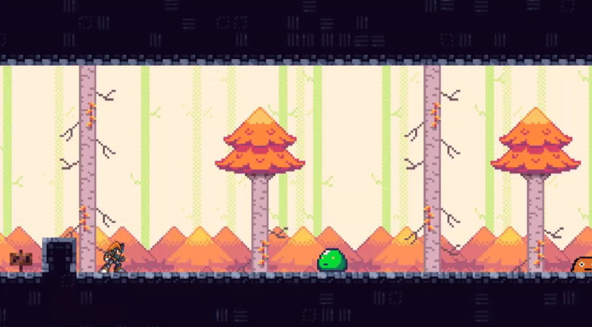

# Development Update #3
In the third milestone, the goal was to create `A State Machine, Enemies & UI Elements`. Here is the progress on that!


## State Machine System
So the neatest thing in this development update by far is the state machine system that I have implemented. Since the system is quite comprehensive, this blog post will only give a broad overview. For more details on this system, check out my [Contribution Reflections Document](../Contribution%20Reflections/README.md)

### Player State Machine Refactor
One big problem problems of my `PlayerMovement` script was that as I added more abilities (or states), it was difficult to manage. I had a lot of booleans like these at the top of my file

```c#
private float _currentSpeed;
private int _moveDirection;
private Vector2 _frameVelocity;
private bool _isJumpHeld;
private bool _canJump;
private bool _jumpConsumed;
private bool _canDash;
private float _dashTimer;
```

The `Update` loop had to check all these booleans all the time to determine the player's state, and over time grew overly complex with all the movement mechanics I had to implement. So the fix was to extract each movement mechanic out into its own state. These were the states I ended up with:


Each state has its own `Update` loop, and only needs to manage its own logic (e.g. the MovingState only handles moving). Since only one state is active at a time, it makes it much simpler to debug if there are problems.

To manage all these states and figure out what state should be active, a "brain" is needed. This "brain" is the `PlayerMovementStateMachine` script. It is responsible for instantiating all the states and give each states access to the Player's components (like Rigidbodies, Colliders, etc.). Lastly, it determines what the next state should be when a state has finished.

Overall, this refactor has turned what once was an overly complex `PlayerMovement` script into a simple, easily extendable `PlayerMovementStateMachine` script.

### Enemy State Machine
Now that the state machine system was in place, it made it a lot simpler to implement my first enemy of the game. The enemy in question is a green slime!


The enemy has three states: idle, patrol and charge. A patrolling area is defined, and the slime patrols back and forth in this area, interrupted by an occasional few seconds of idling. So patrol -> idle -> patrol... When the player gets nearby, the slime will enter the charge state and charge towards the player. This is what that looks like:



After charging, it enters the patrol state again and returns back to its patrolling area.


## UI Elements (Signs)
To get started creating UI elements for the game, I decided to create a sign/dialog system. Here is what that looks like in action!


I wanted to create an easy way to add different texts to different signs. To achieve this, I created a scriptable object called `Dialog`. An instance of this scriptable object can be created for each sign to easily add the dialog it is supposed to show.


One cool feature I discovered was that I could inline sprites into my text. I configured TextMeshPro with a sprite atlas of all controller inputs. After that, I can simply type `<sprite name="name_of_sprite">` to show a controller input in the middle of my sentence. Great for tutorial signs!

## The End
That was it for my last development update. To see how the final game turned out, check out the [Game Showoff Blog Post](../Game%20Showoff/README.md)