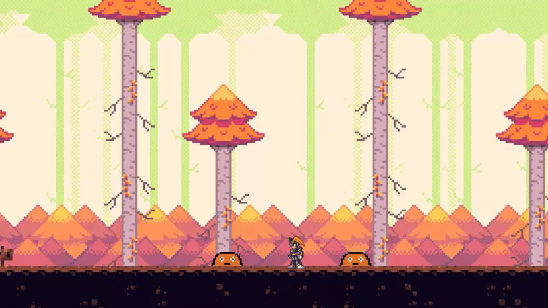
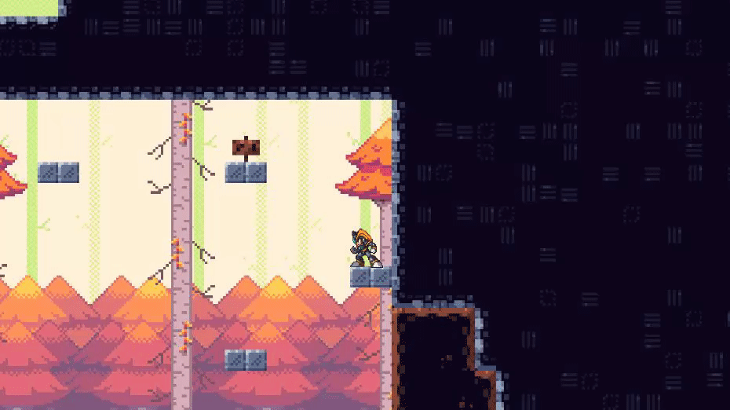
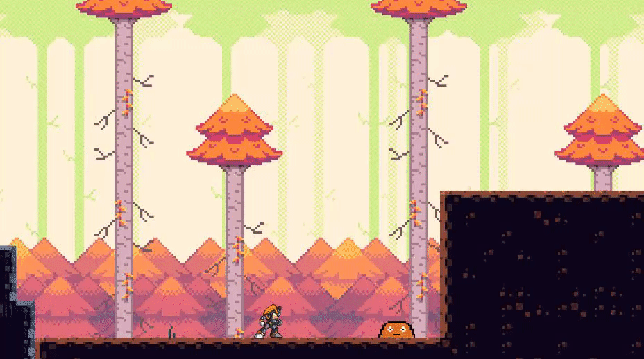

# Game Showoff
It's time to show off my game `Slime Forest: Arcade Adventure`. To get a better idea of what the game looks like in action, check out [this video demonstrating the game](https://youtu.be/zEiievuTiGc). You can also try the game by checking out my [GitHub pages](https://forgottenice.github.io/GMD/) or by downloading the Windows executable on the [releases page](https://github.com/ForgottenIce/GMD/releases)

The game is a 2D platformer with focus on movement, abilities & obstacles. Below is a list of all the key features of the game

## Player and Movement
The player is an athletic character that can move around, jump and dash. Once airborne, the player can only perform one dash until they hit the ground again.

## Enemies
Slime enemies are spread across the stage. These enemies are NOT your friends, and they will try to kill you if you get nearby!

## Camera System
So called "camera zones" are spread across the stage. When the player enters a camera zone, the camera smoothly transitions from the player to the camera zone so the player can get a better overview of what's ahead.

## Parallax Background
To add depth to the background, a parallax system is in place. Instead of having one static background image, the background instead consists of 5 layers that moves at different speeds. Layers closer to the foreground moves faster than the layers behind, giving the illusion that the background layers are further away.

The parallax system also ensures that the background loops infinitely.

## Checkpoint System
The game can be quite challenging with tight platforming and enemies getting in the way. A checkpoint system is in place to make sure the player doesn't lose all their progress every time they die.

## Jump Pads
Jump pads are spread around the levels. They can help the player jump higher than usual. The jump height for each of the jump pads in the level can be configured, depending on how high the jump needs to be.

## Jump Orbs and Dash Orbs
Two kind of orbs exist.

Jump orbs allow the player to perform an additional jump while airborne, essentially making it a double jump. Jump orbs can also be chained one after another, which allows the player to keep jumping.

Dash orbs allow the player to perform an additional dash while airborne. These can also be chained like the jump orbs. The dash orbs can help the player traverse long horizontal distances.

Jump orbs and dash orbs respawns after a little while, so that they are available again.

## Lock and Key System
Keys can be used to unlock new areas.

## Dialog System
The game features a dialog system. By pressing the interact button, the player can cycle through all the dialog of a sign when they are near it.

## Menus
The game three menus: a pause menu, a respawn menu and an ending screen. These menus help the player perform actions such as pausing the game, respawing at the last checkpoint, restarting the game or exiting the game.

## The End
Thanks for reading! :)