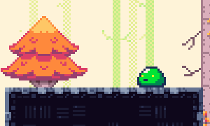

# GMD Course - Simon Lassen
This is a repository for all the projects and blog posts I have created for the GMD Course at VIA University College.

## Blogs
Below is a list of all the blog posts
1. [Roll a Ball](Blogs/Roll-A-Ball/README.md)
2. [Game Design Document](Blogs/Game%20Design%20Document/README.md)
3. [Development Update #1](Blogs/Development%20Update%201/README.md)
4. [Development Update #2](Blogs/Development%20Update%202/README.md)
5. [Development Update #3](Blogs/Development%20Update%203/README.md)
6. [Game Showoff](Blogs/Game%20Showoff/README.md)
7. [Contribution Reflections](Blogs/Contribution%20Reflections/README.md)

## Slime Forest: Arcade Adventure
For my GMD-project, I developed a game called `Slime Forest: Arcade Adventure`. It's a 2D platformer with focus on movement, abilities & obstacles

### YouTube Video

[A demonstration of the game in action can be found here](https://youtu.be/zEiievuTiGc)

### Third party sources
Here is a list of third party assets used in the game.

1. adve Tile Map [(itch.io)](https://egordorichev.itch.io/adve)
2. Kenney Controller Input Sprites [(itch.io)](https://kenney-assets.itch.io/input-prompts-pixel-16)
3. Seasonal Tilesets [(itch.io)](https://grafxkid.itch.io/seasonal-tilesets)
4. Sound Effects [(pixabay.com)](https://pixabay.com/sound-effects/search/8-bit/)
5. Thaleah Pixel Font [(assetstore.unity.com)](https://assetstore.unity.com/packages/2d/fonts/free-pixel-font-thaleah-140059)

## WebGL Builds
WebGL builds of `Roll a Ball` and `Slime Forest: Arcade Adventure` can be found at [https://forgottenice.github.io/GMD](https://forgottenice.github.io/GMD/)

## Windows Builds
A Windows build of `Slime Forest: Arcade Adventure` can be found on the [releases page](https://github.com/ForgottenIce/GMD/releases)