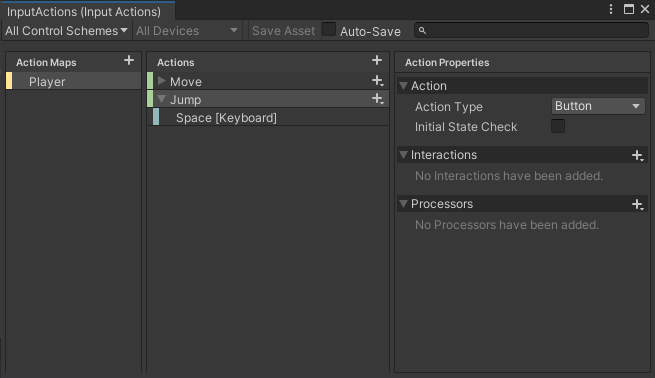
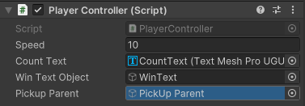
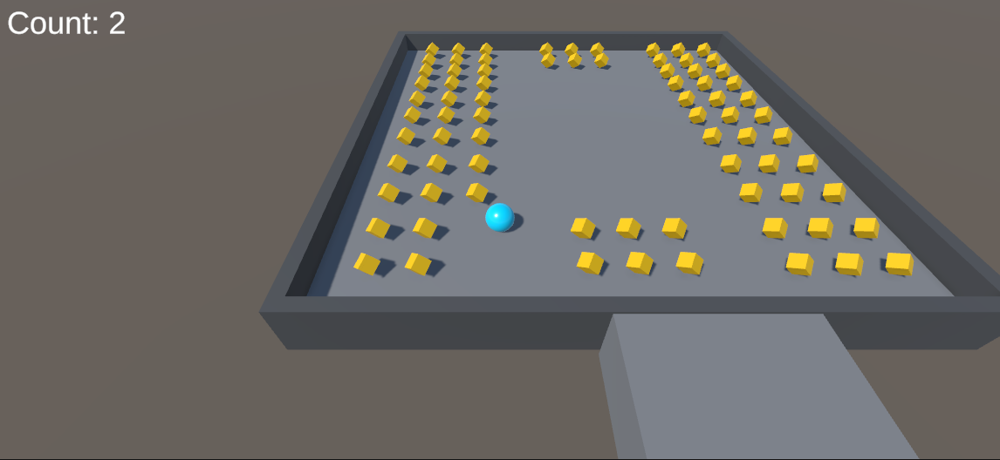

# Roll a Ball Blog
Welcome to my first blog post in the GMD course! In this first project, I followed the [Roll-a-Ball](https://learn.unity.com/project/roll-a-ball) tutorial from Unity. I started off completing the tutorial with a 1:1 clone of the game that was made in the tutorial. Then later on, I made some additional changes myself.

## Comments on the Tutorial
Overall the tutorial was very simple to follow. I have previously worked in Unity, but it has been quiet a while, so it was a nice refresher. I was familiar with most of the concepts introduced, but it's the first time I have worked with the new input system.

## My Additions
After finishing the tutorial, I made a few additional changes.
### Jumping
I decided to add a jump mechanic. To achieve this, I first added a "Jump" action to my Input Actions

Now, whenever the spacebar is pressed, the `OnJump()` method is invoked in the PlayerController script. My implementation looks like this:
```c#
private void OnJump()
{
    if (canJump) {
        Vector3 curVel = rb.velocity;
        rb.velocity = new Vector3(curVel.x, 10, curVel.z);
    }
}
```
I first check if the player can jump. If they can, I give the Player's rigidbody a new Vector3 for its velocity property. The x and z values stay the same, but the y is set to 10 which effectively gives the player a boost upwards.

Now, how do I determine how the player can jump? Like this:
```c#
private void OnCollisionEnter()
{
    canJump = true;
}

private void OnCollisionExit()
{
    canJump = false;
}
```
Since the Player GameObject has a collider component, I can react to various trigger events. I use the `OnCollsionEnter` event to enable jumping every time the Player collides with another GameObject. Then I use the `OnCollsionExit` event to disable jumping when the player is no longer colliding with other objects. Obviously this could be abused if the player is hugging a wall, but I decided not to bother with that since no tall walls are present in the game anyways.

### Dynamic Win Condition
So in the tutorial, the win condition was hardcoded inside the PlayerController. It looked like this:
```c#
if (count >= 78)
{
    winTextObject.SetActive(true);
}
```
Now this was a bit annoying since every time I added more PickUp objects, I would have to manually adjust this number. There is a simple solution to this. Since every PickUp object is contained inside the "PickUp Parent" object, I can just count the amount of children "PickUp Parent" contains. First, the PlayerController needs access to the "PickUp Parent" object. I added the following line to the top:
```c#
public GameObject pickupParent;
```
Then in the Unity editor, I dragged the PickUp Parent from the hierarchy to the "PickUp Parent" slot on the PlayerController script

Finally, I changed the win condition to the following:
```c#
if (count >= pickupParent.transform.childCount)
{
    winTextObject.SetActive(true);
}
```
And just like that, I have a dynamic win condition that is synced to the total amount of PickUps.

## The Result
